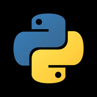

# Kattis

 
 
 

<b>

<h3>This is just to help people</h3>
<h3>Do not use this to cheat</h3>
<h3>I will slowly be adding JavaScript and Python solutions</h3>

</b>

## Hello World!
-   [C++](HelloWorld!/hello.cpp)
-   [Python 3](HelloWorld!/hello.py)
-   [JavaScript (Node.js)](HelloWorld!/hello.js)
-   Difficulty 1.2

## R2
-   [C++](R2/r2.cpp)
-   [Python 3](R2/r2.py)
-   [JavaScript (Node.js)](R2/r2.js)
-   Difficulty 1.2

## Quadrant Selection
-   [C++](QuadrantSelection/qs.cpp)
-   Difficulty 1.2

## Solving for Carrots
-   [C++](SolvingforCarrots)
-   Difficulty 1.2

## Planina
-   [C++](Planina/planina.cpp)
-   Difficulty 1.2

## Cold-puter Science
-   [C++](Cold-puterScience/cold.cpp)
-   Difficulty 1.2

## Bijele
-   [C++](Bijele/bijele.cpp)
-   Difficulty 1.2

## Autori
-   [C++](Autori/autori.cpp)
-   Difficulty 1.2

## Heart Rate
-   [C++](HeartRate/rate.cpp)
-   Difficulty 1.2

## FizzBuzz
-   [C++](FizzBuzz/fz.cpp)
-   Difficulty 1.2

## Filip
-   [C++](Filip/flip.cpp)
-   Difficulty 1.2

## Faktor
-   [C++](Faktor/fac.cpp)
-   Difficulty 1.2

## Dice Cup
-   [C++](DiceCup/dice.cpp)
-   Difficulty 1.2

## Tarifa
-   [C++](Tarifa/tar.cpp)
-   Difficulty 1.3

## Take Two Stones
-   [C++](TakeTwoStones/stone.cpp)
-   Difficulty 1.3

## Stuck In A Time Loop
-   [C++](StuckInATimeLoop/time.cpp)
-   Difficulty 1.3

## Spavanac
-   [C++](Spavanac/spa.cpp)
-   Difficulty 1.3

## Sibice
-   [C++](Sibice/sibice.cpp)
-   Difficulty 1.3

## Quality-Adjusted Life-Year
-   [C++](Quality-AdjustedLifeYear/life.cpp)
-   Difficulty 1.3

## Pot
-   [C++](Pot/pot.cpp)
-   Difficulty 1.3

## Piece of Cake!
-   [C++](PieceofCake/cake.cpp)
-   Difficulty 1.3

## Oddities
-   [C++](Oddities/odd.cpp)
-   Difficulty 1.3

## Nasty Hacks
-   [C++](NastyHacks/advertise.cpp)
-   Difficulty 1.3

## Last Factorial Digit
-   [C++](LastFactorialDigit/last.cpp)
-   Difficulty 1.3

## Speed Limit
-   [C++](SpeedLimit/sp.cpp)
-   Difficulty 1.3

## Pet
-   [C++](Pet/pet.cpp)
-   Difficulty 1.3

## No Duplicates
-   [C++](NoDuplicates/no.cpp)
-   Difficulty 1.3

## IsItHalloween.com
-   [C++](IsItHalloween.com/main.cpp)
-   Difficulty 1.3

## Zamka
-   [C++](Zamka/z.cpp)
-   Difficulty 1.3

## 3D Printed Statues
-   [C++](3DPrintedStatues/3d.cpp)
-   Difficulty 2.1

